# GEDA: Generative Excel Data Assistant

## Introduction

GEDA (Generative Excel Data Assistant) is an intelligent Python-based assistant that uses open- and closed-source language models to interact with Excel files through natural language queries. It enables users to upload Excel files, query and manipulate data, perform complex analysis, and generate visualizations, all through a chat-like interface. GEDA leverages the power of language models to understand user intent and execute tasks using pre-defined Python functions.


## Architecture

To describe the architecture, it is best to first understand the basic workflow of GEDA.

The flow of the system is as follows:

1. The user uploads Excel files.
2. GEDA extracts metadata from the files, including information about the file contents, and caches this metadata.
3. The user sends a prompt to GEDA.
4. GEDA uses RAG to analyze the user's request and selects the top 5 functions that best fit the query.
5. GEDA sends the 5 best functions with the parameters and descriptions to the LLM to determine the most suitable function.
6. The relevant python function is executed with the extracted parameters from the prompt.
7. The metadata is used to select the necessary Excel files in order to perform the requested task.
8. If Excel editing is required, the XlsxWriter library is used to edit a file.
9. The result of the query is returned to the user in either textual, tabular or graphical form.

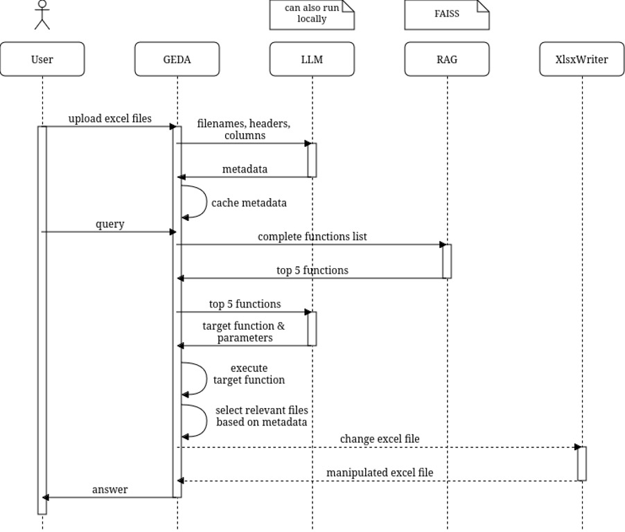

### Retrieval-Augmented Generation (RAG)

To make the system scalable, we have decided to use Retrieval-Augmented Generation (RAG). This approach involves storing all function names and descriptions in a vector database. We use [FAISS](https://faiss.ai) for the RAG implementation because it is easy to integrate and has proven to deliver the best functionality in our tests. The RAG system returns the top 5 functions, which are then passed to the LLM along with their descriptions and list of parameters. This ensures that the prompt remains concise, improving the correctness of the LLM’s answers. This approach allows us to create a vast number of functions and still obtain correct answers.

Before using RAG, all functions were passed to the LLM along with their parameter list. However, upon increased size of the function catalogue, it often led to the LLM calling incorrect functions or even hallucinating (inventing new functions and providing nonsense parameter values) during execution.

### Metadata extraction

Immediately after the user uploads Excel files, GEDA starts inspecting the uploaded files and detects the header row to ensure accurate data extraction. Then GEDA creates Panda dataframes from the Excel files. The optional information that sometimes appears above the header row (title and description) is saved into an `info_text` array. Based on the file name, the header row (column names), and the rows above the header row (optional title and description), GEDA asks an LLM to analyze what the files contains and to generate a `metadata` dictionary for each file. For time-saving purposes, GEDA caches the metadata dictionary in JSON format to save time in the future. The cached data is cleared upon restarting GEDA.

The metadata dictionary contains the following information:

- **type:** The type of data in the file (e.g., sales, inventory).
- **country_code:** The country code of the data (e.g., US, UK).
- **year_from:** The starting year of the data.
- **year_to:** The ending year of the data.
- **columns:** A dictionary mapping standardized column names to their individual column names in the corresponding files.
- **checksum:** A checksum to detect changes. If the checksum changed, the metadata is updated.

An example of a metadata dictionary is shown below (the input is shown on the left side and the metadata is shown on the right side):

| Input Filename: `Sales data_US_2020.xlsx` | Metadata                                                                                                                                                                                                                                   |
| ----------------------------------------- | ------------------------------------------------------------------------------------------------------------------------------------------------------------------------------------------------------------------------------------------ |
| 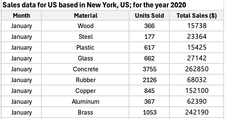 | `json { "type": "sales", "country_code": "US", "year_from": "2020", "year_to": "2020", "columns": { "month": "Month", "material": "Material", "units_sold": "Units Sold", "total_sales_dollar": "Total Sales ($)" }, "checksum": "..." } ` |

### Data Extraction

Next to the Metadata extraction, there is also the extraction of the Excel files data itself. Once the header row has been detected, the actual content of the file is copied into a Pandas Dataframe, which the functions can work with.

### File Mapping

Since the user may want to manipulate a file, he also needs to be able to download it. Instead of only providing a download link through the Chat, we also wanted to allow the user to download the new Excel File from the Gradio files block.

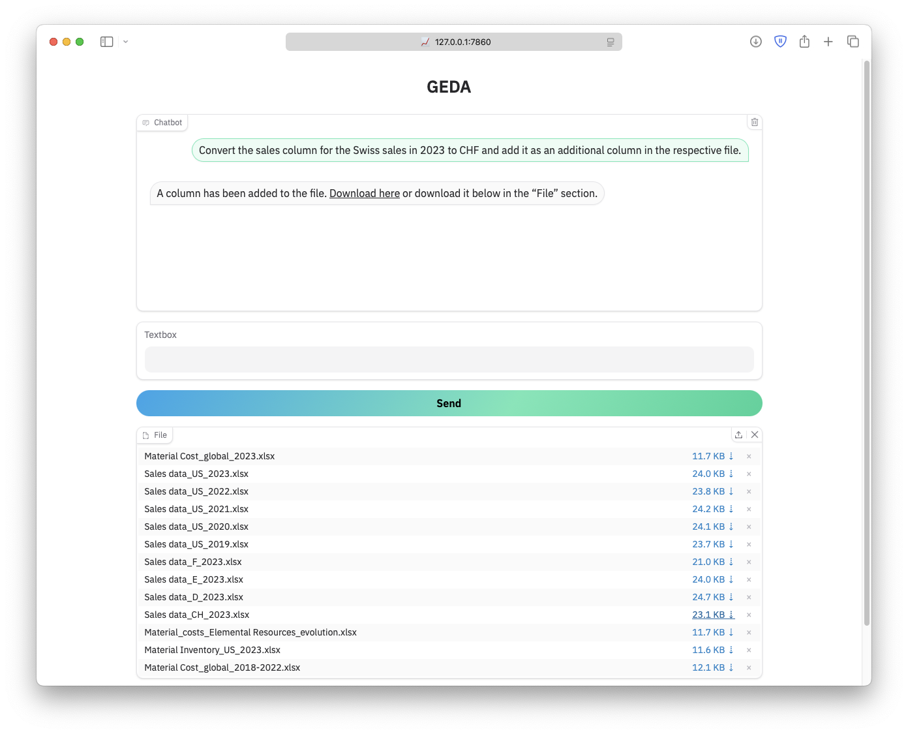

To know where the file we want to manipulate is stored by Gradio, we had to create a file mapping, which is basically just a JSON file used by GEDA to store file path mappings, and it looks like this:

```json
{
   "Material Cost_global_2023.xlsx": "/private/var/folders/lw/fn0mldhj73s37204drkzkykc0000gn/T/gradio/a581c98ada7e3d17d9c737da0ba6b2faf6f1e6c6d3a1159fd85eb3c5d5bc4232/Material Cost_global_2023.xlsx",
   "Sales data_US_2023.xlsx": "/private/var/folders/lw/fn0mldhj73s37204drkzkykc0000gn/T/gradio/7da8b6617ec825fcf5fd294d56d72450f4e2a408a0a05096f60d7381c682adc4/Sales data_US_2023.xlsx”
}
```

## Supported Prompts

To maintain control over the tasks a user can execute through the chat interface, we utilize function calling. This approach requires implementing a specific function for each use-case, ensuring precise control over what actions are permitted and preventing unintended manipulation of data.

### Key Features

- **Excel File Handling:** Users can upload and interact with one or more Excel files.
- **Natural Language Understanding:** GEDA can interpret user prompts using different LLMs (ability to switch between ChatGPT 4o-mini and open-source models on the LLMHub or even local models) and execute tasks while also utilizing different technologies like RAG and the XlsxWriter Python Library.
- **Function Calling:** Map user intent to pre-defined Python functions for safe and effective operations.
- **Data Analysis & Visualization:** Query individual cells, create new columns, and plot visualizations like histograms or line plots. We’re very proud to be the only group (to our knowledge) offering interactive plots.
- **User Interface:** Chat interface for uploading Excel files, interacting with them and downloading the edited files created with Gradio.
- **Currency Conversion:** GEDA has support for external web APIs, specifically price conversion using an external service for currency conversion rates.
- **Comparisons & Analysis:** Our GEDA can handle complex tasks such as timeseries comparison, sales comparisons, and cost analysis.
- **Identify the right files:** GEDA can handle multiple Excel files uploaded to intelligently identify and fetch the appropriate Excel files based on the user’s query.
- **Instructions encompassing data over multiple files:** It can automatically locate and process relevant Excel files based on the user query, then provide an answer encompassing data from multiple files.

### Sample Prompts

The list below shows some samples of supported prompts. As is usual with LLMs, prompts that are written differently can also be interpreted. The list is not exhaustive though.

- Hello, nice to talk to you today &#128522; (Random prompts to the LLM model)
- Which supplier delivers wood?
- What supplier is selling copper in 2023?
- Where can I find the cost for wood in the year 2023 and what is it?
- For the Sales data of the US in 2023 add a column that indicates the price per unit.
- Return the total Sales of Switzerland for each month in 2023.
- Plot the evolution of sales for every month in Switzerland for 2023.
- Plot the evolution of sales of Steel from January to June in Switzerland for 2023 for wood in Euro.
- State the sales of Brass in Switzerland for January 2023, in Swiss Francs (CHF).
- Convert the sales column for the Swiss sales in 2023 to CHF and add it as an additional column in the respective file.
- Compare the price per unit of graphene in Q1 2020 and Q4 2023.
- List the sales of Tin in 2023 in Swiss Francs globally.
- List the sales of Gold in 2023 in France in USD.
- Can you compare the total sales in Germany for 2023?
- Can you plot the total sales in Germany for 2023 as an interactive line plot?
- Show me a plot graphic of both the units sold and the total Sales of the USA from June to October in 2023 in Euro, but only about the material Iron.
- Plot both the evolution of sales and the sold amount of units of Steel from January to June in Switzerland for 2023 in Euro as an interactive bar plot.

### Screenshots of Working GEDA

This section shows some screenshots showcasing the functionality of GEDA.

GEDA had all the Excel files of the “Training data” folder (which was uploaded on moodle) available to answer each of the following prompts and intelligently identified and fetched the appropriate Excel files based on the user’s query.

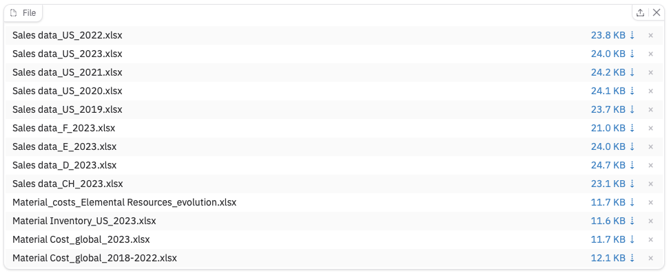

In the following section you will find an example of a conversation with GEDA. For intuitive user experience, we chose a simple chat-like approach to our interface similar to ChatGPT, without multiple tabs or too many blocks. All while not taking any compromise on functionality.


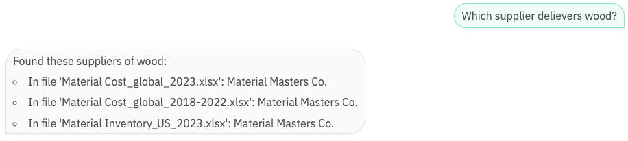
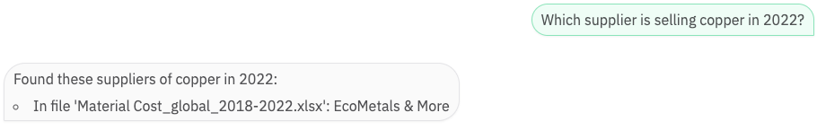
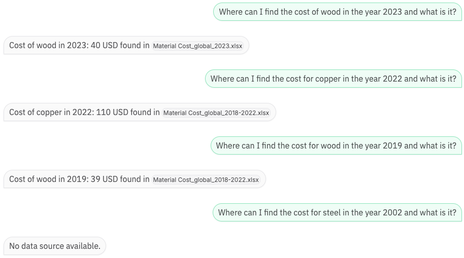

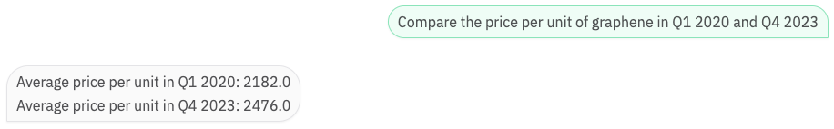
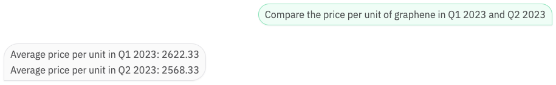
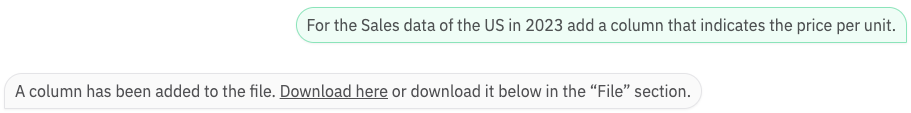

\*Downloaded Excel file:

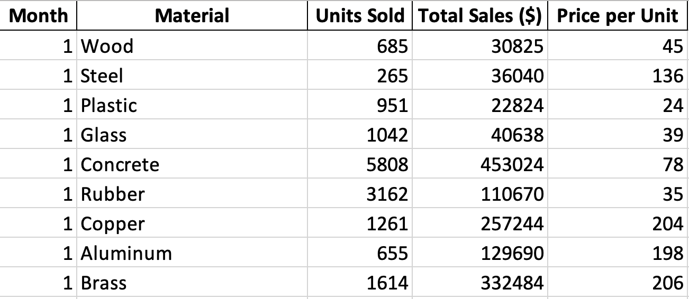


\*Output only shows USA since the only data source for sales in 2019 is of the USA.

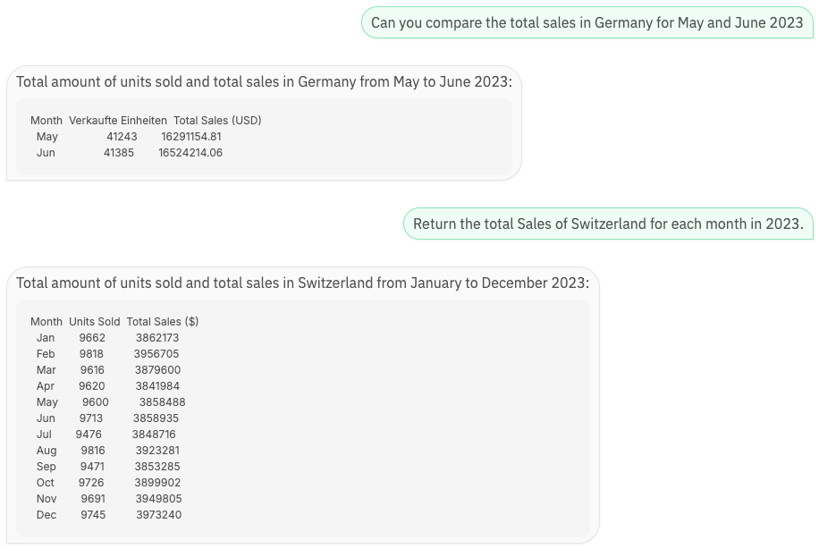
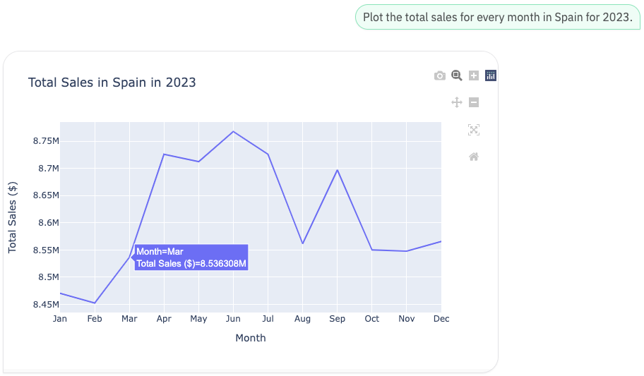
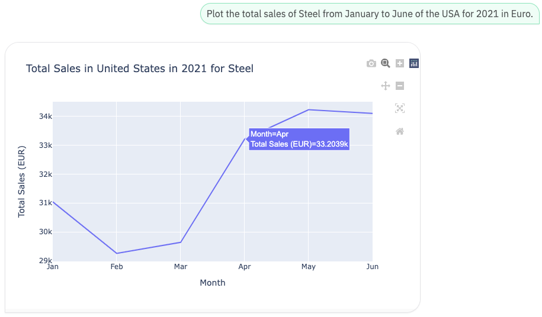
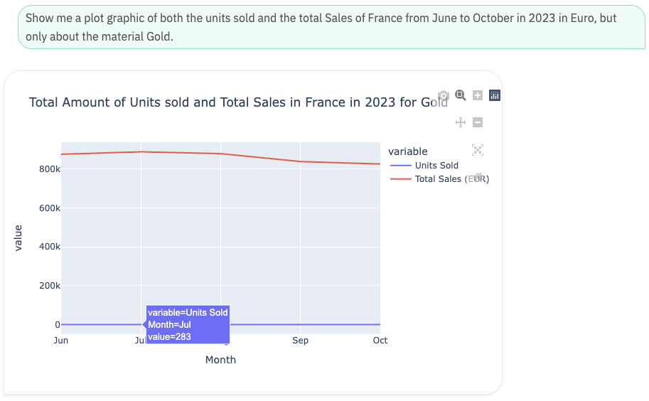
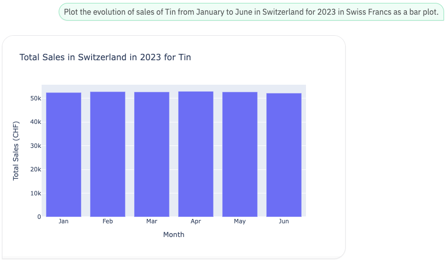
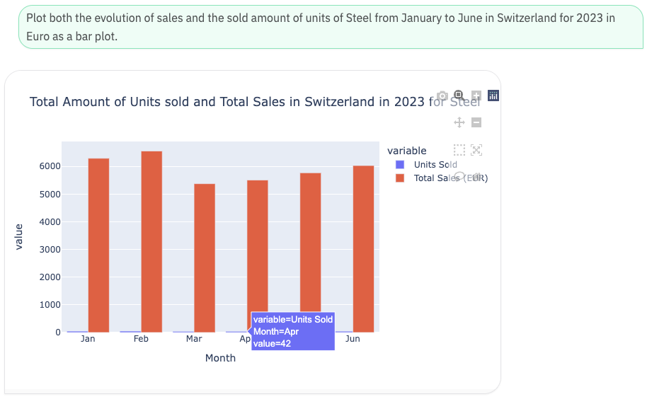

It is questionable if it makes sense to ask for both metrics in a single chart, but if the user wants it, GEDA shall deliver 🪄

As you can see, our GEDA is able to handle a wide variety of questions.

## Installation

1. Clone the repository:
   ```bash
   git clone <repo link>
   ```
2. Install the required packages:
   ```bash
   pip install -r requirements.txt
   ```
3. Rename the `.env.example` file to `.env` and update the environment variables.
4. Run the application:
   ```bash
   python gui.py
   ```
5. Access the web interface at `http://localhost:7860`.

### Usage of Different Models

Our GEDA offers different language models to choose from. The models are either hosted on llmhub (llama3.1), OpenaAI (gpt-4o-mini) or locally installed (llama3.2 model with 3B parameters). The model can be specified in the `.env` file. When using a local model, the installation steps noted below need to be followed.

1. Download of offline model from [ollama.com](https://ollama.com/).
2. Open a command prompt and download the model:
   ```bash
   ollama pull llama3.2
   ```
3. Start the Ollama server:
   ```bash
   ollama serve
   ```
4. Make sure the environment variable `MODEL_NAME` is set to the model name:
   ```bash
   MODEL_NAME="llama3.2"
   ```

### Evaluation

With the implementation of RAG, which narrows down the function call candidates to the top 5 based on the user's query, all hosted models demonstrate satisfactory performance. This architecture ensures that the language models receive concise and relevant information, reducing the complexity of the prompt and improving correctness in function selection.

In terms of performance, OpenAI's "gpt-4o-mini" is noticeably faster and more efficient than the alternatives. Its responsiveness makes it an ideal choice for applications where quick query resolution is crucial. Using models hosted on “llmhub” is also fast.

On the other hand, the locally hosted Llama 3.2 model (3B parameters) struggles to match the performance of its counterparts. Its inference time is slower, which can be attributed to hardware limitations, particularly the lack of a high-performance GPU. While Llama 3.2 does function correctly within the GEDA framework, its speed constraints make it less practical for real-time or high-volume usage scenarios.

### Justification

In summary, the combination of RAG and robust language models ensures that GEDA operates effectively, with "gpt-4o-mini" standing out as the best option for speed and reliability. The locally hosted Llama, while functional, requires better hardware to achieve comparable performance.

## Discussion

We have noticed that LLMs sometimes struggle to figure out what functions to call, especially if there are functions tailored to specific prompts, but they do similar things or take similar parameters. To combat this, we tried to make the function descriptions as clear as possible. However, this is not always enough. What we also did was try to make the functions as capable as possible, but at the same time, as generic as possible. This was achieved by adding more options (parameters) but also by defining default parameters if no information for them is provided and, thus, making the function as flexible as possible. This way, the LLM can call the same function for similar tasks, which makes it easier for the LLM to understand what to do, and redundant code is minimized since there are no longer multiple functions doing similar things.

For example, a function made to fulfill the prompt _"Plot the evolution of sales for every month in Switzerland for 2023"_ should not only do exactly that but should also be able to accept a specific month range and should be able to convert the currency of the resulting data to whatever the user wishes. If the user additionally wants to see the evolution for example for a specific material only, the function should also be able to handle it. This way, the same function can also fulfill _“Plot <u>both</u> the evolution of sales <u>and the sold <span style='mso-bidi-font-style:italic'>number</span> of units</u> <u>of Steel</u> <u>from January to June</u> in Switzerland for 2023 <u>in Euro</u> <u>as a bar plot</u>”_. Thus, the function can handle ambiguous queries and provide interactive feedback using an interactive plot.

Another key observation is that as the complexity of the input Excel data increases, writing functions that can handle diverse scenarios becomes significantly more challenging. For instance, datasets with intricate relationships, multiple interdependent columns, or varying formats require more sophisticated logic and parameter flexibility. This added complexity makes it important to design functions that are both powerful and adaptable, ensuring they can interpret and process nuanced data structures effectively while maintaining usability.

### Learning

The implementation of RAG proved to be straightforward and highly beneficial. By acting as a "filter" to narrow down the possible functions to only the top 5 relevant ones, RAG not only simplified the task for the LLM but also significantly improved accuracy in function selection. This way, the gap between how the open-source language model interprets and handles natural language queries compared to the gpt-4o was narrowed.

We’ve learned that engineering chatbot applications around existing LLMs is actually useful for companies, but they are only as capable as the "tools" (i.e., the functions) they are provided with. We also learned that using an LLM as a function calling agent is very powerful and opens lots of possibilities for AI engineering but is also not always deterministic.

In order to bring GEDA to a production-ready status, several user tests would have to be carried out to evaluate and then expand the range of functions. Furthermore, it would be crucial to have a metric to compare prompt changes or accuracy of different models.
